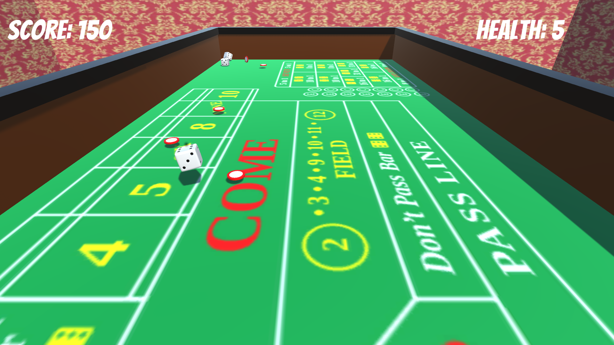
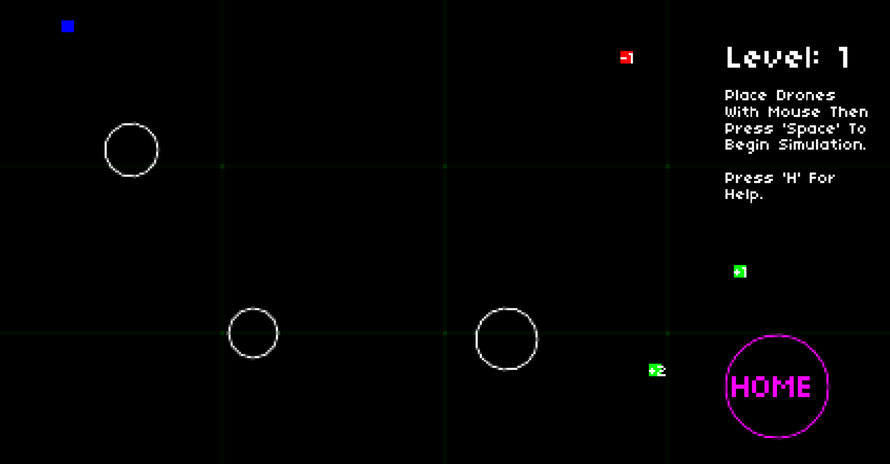

## Andrew McClean

I’m a UI & Gameplay Engineer with nearly two years of professional AAA game development experience using C++ and Unreal Engine 5. I also completed a Master’s Degree in Computer Science from University College Dublin that covered a wide variety of topics, from web development and computer networks, to AI and cloud computing. Prior to studying Computer Science, my undergraduate degree was in Engineering Science with a specialisation in Electronic Engineering.

I have worked on various AAA projects for PC and Console at multiple AAA development studios. My main contributions have been in UI Development and with 3Cs (Character, Controls & Camera). I have taken ownership of, and personally developed several UI elements and gameplay features, while also collaborating with other teams on various multidisciplinary tasks. I am well acquainted with Agile/Scrum methodology and I’m used to integrating quickly with new teams and tech stacks.

I’ve also worked on several game-jam projects, both solo and as part of a team. I used these to experiment and learn new tools such as Unity and Love2D as well as to hone my teamwork and planning skills.

I am incredibly passionate about video game development and strongly believe in its potential as a unique artistic medium. I am dedicated to my work and I love how it blends both technical problem solving and creative expression. There’s nothing I enjoy more than putting myself in the mind of a player to create intuitive, immersive, and engaging interfaces and gameplay.

## Portfolio

### Exploding Dice: GMTK Game Jam 2022 Submission

  

https://fishtail.itch.io/exploding-dice

Exploding Dice was my GMTK Game Jam submission for 2022. It was a solo project developed with the Unity Engine developed over the course of 48 hrs. The theme of the game jam was "Roll of the Dice". The player throws dice at approaching casino to prevent them from reaching the bottom of the screen. The Dice explode after they stop moving and the size of the explosion is determined by the value rolled by the die. I used the project as a way to to help me learn the Unity Engine and how explosions and particle effects are handled.

### Coulomb's Capsules: GMTK Game Jam 2020 Submission

  

https://fishtail.itch.io/coloumbs-capsules

Coulomb's Capsules is a game I submitted as part of the GMTK 2020 game jam and is the first video game I have ever made. It was a solo project developed over 48 hours adhering to the provided theme of “out of control”. The player attempts to bring an out of control escape pod (the blue square) home whilst avoiding dangerous asteroids. This is done by attracting and repelling it using deployable electrically charged drones. The game uses Coulomb's law as the basis for it's physics, hence the name.

## Contact Info

LinkedIn: https://www.linkedin.com/in/andrew-mcclean-108339137/

Email: andrewmcclean97@gmail.com
