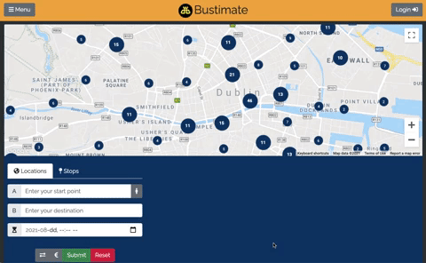
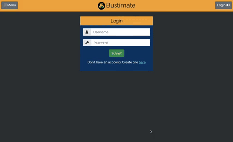

## Andrew McClean

I’m a UI & Gameplay Engineer with nearly two years of professional AAA game development experience using C++ and Unreal Engine 5. I also completed a Master’s Degree in Computer Science from University College Dublin that covered a wide variety of topics, from web development and computer networks, to AI and cloud computing. Prior to studying Computer Science, my undergraduate degree was in Engineering Science with a specialisation in Electronic Engineering.

I have worked on various AAA projects for PC and Console at multiple AAA development studios. My main contributions have been in UI Development and with 3Cs (Character, Controls & Camera). I have taken ownership of, and personally developed several UI elements and gameplay features, while also collaborating with other teams on various multidisciplinary tasks. I am well acquainted with Agile/Scrum methodology and I’m used to integrating quickly with new teams and tech stacks.

I’ve also worked on several game-jam projects, both solo and as part of a team. I used these to experiment and learn new tools such as Unity and Love2D as well as to hone my teamwork and planning skills.

I am incredibly passionate about video game development and strongly believe in its potential as a unique artistic medium. I am dedicated to my work and I love how it blends both technical problem solving and creative expression. There’s nothing I enjoy more than putting myself in the mind of a player to create intuitive, immersive, and engaging interfaces and gameplay.

## Portfolio

### Bustimate: Estimating Dublin Bus Travel Times

 

https://github.com/AMcClean97/Dublin_Bus.git

Bustimate is a web-application I developed as part of a 3-person scrum for the practical component of my MSc. It is designed to accurately predict travel times for journeys using Dublin Bus input by the user. Travel time predictions were created using Machine Learning Algorithms that were trained using historical data provided as part of the assignment. The application was also capable of calculating fares, storing favourite routes, providing users with real-time bus arrival times, and detecting the user's current location.

I worked as a full-stack developer during this project, I was in-charge of the frontend UI but also had to develop backend features such as the log-in, favourites system, fare calulator and unit-testing. Co-operating on this project was a difficult task as we couldn't meet in person due to the Covid-19 pandemic. We instead used discord to communicate and trello-boards to mark our progress during each sprint. We also used google-sheets to make shared burndown charts.

### Coulomb's Capsules: GMTK Game Jam 2020 Submission

  

https://fishtail.itch.io/coloumbs-capsules

Coulomb's Capsules is a game I submitted as part of the GMTK 2020 game jam and is the first video game I have ever made. It was a solo project developed over 48 hours adhering to the provided theme of “out of control”. The player attempts to bring an out of control escape pod (the blue square) home whilst avoiding dangerous asteroids. This is done by attracting and repelling it using deployable electrically charged drones. The game uses Coulomb's law as the basis for it's physics, hence the name. There is some recorded gameplay footage above.

## Contact Info

LinkedIn: https://www.linkedin.com/in/andrew-mcclean-108339137/

Email: andrewmcclean97@gmail.com
